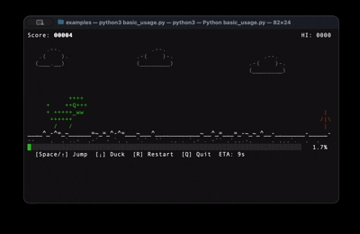

# playgress

> A progress bar that lets you play the Chrome T-Rex game in your terminal.



Your long-running script doesn't have to be boring. **playgress** wraps any
iterable in a full T-Rex side-scroller — jump cacti, dodge birds, rack up a
high score — while your real work happens in the background. When the task
finishes the game keeps running until you decide to quit.

---

## Features

- **Zero runtime dependencies** — pure Python standard library
- **Drop-in `tqdm` replacement** — `track()` has the same call signature
- **`Progress` context manager** — for manual update control
- **60 FPS physics** — faithful gravity, jump arc, and speed curve from the
  original Chrome dino
- **Autoplay AI** — built-in geometric look-ahead controller (`autoplay=True`)
- **Double-buffered renderer** — flicker-free diff-based redraw, single write
  per frame
- **Cross-platform** — macOS, Linux, Windows (ANSI terminal required)
- **Python 3.11+**

---

## Installation

```bash
pip install playgress
```

Or for local development:

```bash
git clone https://github.com/mikhail-samoilov/playgress
cd playgress
pip install -e ".[dev]"
```

---

## Quickstart

### Drop-in replacement for `tqdm`

```python
import time
from playgress import track

for item in track(range(100), description="Processing"):
    time.sleep(0.05)
```

### Any iterable works

```python
files = ["data_001.csv", "data_002.csv", ...]

for f in track(files, description="Crunching files"):
    crunch(f)
```

### Manual control with the `Progress` context manager

```python
from playgress import Progress

steps = ["Download", "Extract", "Build", "Install"]
with Progress(total=len(steps), description="Installing") as p:
    for step in steps:
        p.set_description(f"Step: {step}")
        run(step)
        p.update(1)
```

### Let the AI play for you

```python
for epoch in track(range(200), description="Training", autoplay=True):
    train_one_epoch(epoch)
```

---

## Keyboard controls

| Key | Action |
|-----|--------|
| `Space` / `↑` | Jump |
| `↓` | Duck on ground / fast-drop mid-air |
| `R` | Restart after game-over; replay after task completes |
| `Q` / `Ctrl-C` | Quit — unblocks the script |

> **Note:** The game keeps running after all items are processed so you can
> finish your current run. Press **Q** when you're done.

---

## Themes

The default theme uses prototype-verified ASCII art that renders crisply in
every monospace font:

```
       ++++          /|\/|\       <o=-
++    ++Q+++          |  |          |
 + +++++_ww
  ++++++
   |   |
```

An `EMOJI` theme (`theme=Theme.EMOJI`) for full Unicode width terminals is on
the roadmap.

---

## API reference

### `track(iterable, *, description, total, theme, autoplay, disable)`

| Parameter | Type | Default | Description |
|-----------|------|---------|-------------|
| `iterable` | `Iterable[T]` | — | Items to iterate over |
| `description` | `str` | `"Processing..."` | Status line label |
| `total` | `int \| None` | `None` | Item count; auto-inferred from `len()` |
| `theme` | `Theme` | `Theme.AUTO` | Sprite theme |
| `autoplay` | `bool` | `False` | Enable AI controller |
| `disable` | `bool` | `False` | Skip game; yield items silently |

Returns a generator that yields items from `iterable` unchanged.

### `Progress(total, description, theme, autoplay)`

| Method | Description |
|--------|-------------|
| `update(n=1)` | Advance by *n* steps (thread-safe) |
| `set_description(text)` | Update the status line label |
| `fraction` | Current progress as a float in `[0, 1]` |

---

## CI / non-interactive environments

When `stdout` is not a TTY (piped output, GitHub Actions, `pytest`) the game
is automatically bypassed and items are yielded with zero overhead. No
`disable=True` guard needed.

---

## How it works

```
Main thread          Game thread (60 FPS)     Input thread
──────────           ────────────────────     ────────────
for item in track():
  yield item    ←→   read ProgressState  ←←   push InputEvent
  completed += 1     run physics               (termios raw mode /
                     render diff frame          msvcrt poll)
shutdown.wait()
```

Three threads, two shared objects: a `ProgressState` (protected by a
`threading.Lock`) and a `queue.Queue[InputEvent]` (lock-free). The game thread
owns all `GameState` mutations — no other thread touches it.

---

## License

MIT — see [LICENSE](LICENSE).
